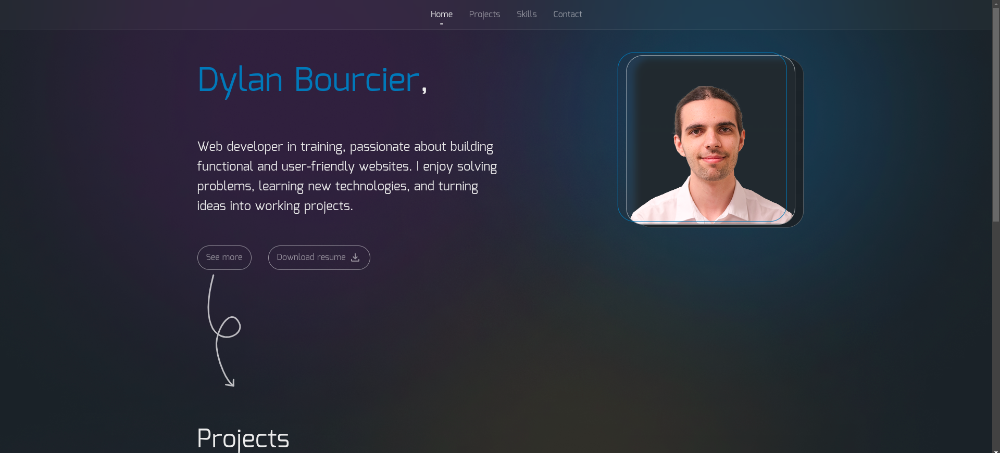

# 🌐 Mon Portfolio

Bienvenue sur mon portfolio ! Ce site présente mes projets, mes compétences et mon parcours en tant que développeur web.

🚀 [Voir le portfolio en ligne](https://dylanbourcier.me)

---

## ✨ Fonctionnalités

- **Présentation** : Introduction et description de mon profil.
- **Projets** : Affichage interactif de mes réalisations (avec un slider).
- **Compétences** : Liste des technologies et outils que j'utilise.
- **Contact** : Formulaire ou liens vers mes réseaux sociaux.

---

## 🛠️ Technologies utilisées

- **Frontend** : HTML, CSS (Sass/Tailwind), JavaScript (Vanilla).
- **Effets & Animations** : CSS animations, Intersection Observer API.
- **Autres** : Git, Figma pour le design.

---

## 📸 Aperçu

  

---

## 🚀 Installation & Exécution

1. **Cloner le repo**  
   ```sh
   git clone https://github.com/dylanBourcier/portfolio.git
   ```
2. **Ouvrir le fichier `index.html`** dans un navigateur.

---

## 💌 Me Contacter

📧 Email : [dylan.bourcier.27@gmail.com](mailto:dylan.bourcier.27@gmail.com)  
🔗 LinkedIn : [linkedin.com/in/dylan-bourcier/](https://www.linkedin.com/in/dylan-bourcier/)  
🐙 GitHub : [github.com/dylanBourcier](https://github.com/dylanBourcier)  

---

## 📄 Licence

Ce projet est sous licence MIT - Voir le fichier [LICENSE](./LICENSE) pour plus d’informations.

